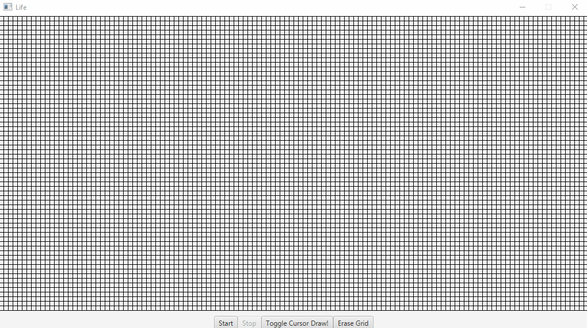

# Life

Inspired by John Conway's famous [*Game of
Life*](https://en.wikipedia.org/wiki/John_Horton_Conway#Conway's_Game_of_Life).



## Install and Run

This project uses [Java](https://www.oracle.com/java/technologies/downloads/) and the [Maven](https://maven.apache.org/)
build tool.

To install and run this application, execute these commands:

```
git clone git@github.com:wcygan/life.git
cd life
mvn clean javafx:run
```

## Rules:

* Any live cell with two or three neighbors survives.
* Any dead cell with three live neighbors becomes a live cell.
* All other live cells die in the next generation. Similarly, all other dead cells stay dead.